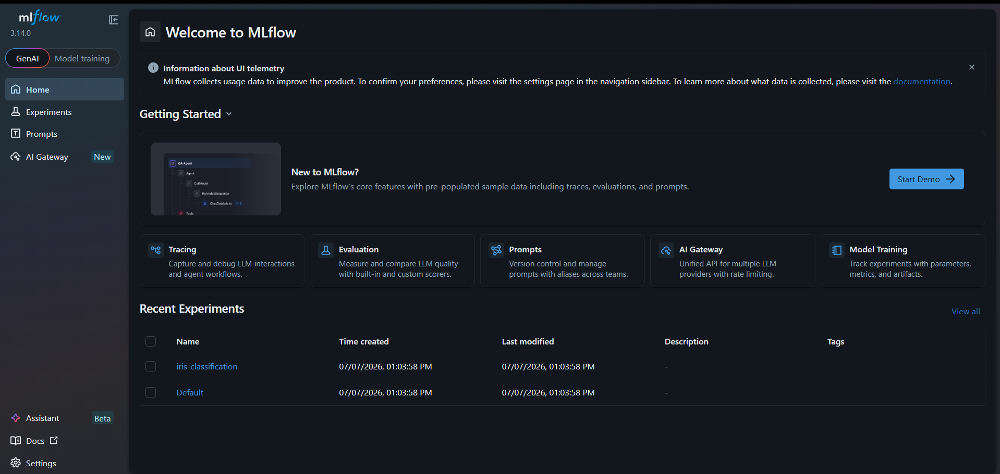
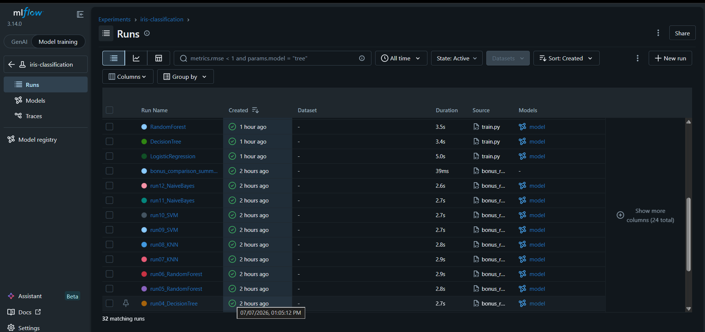
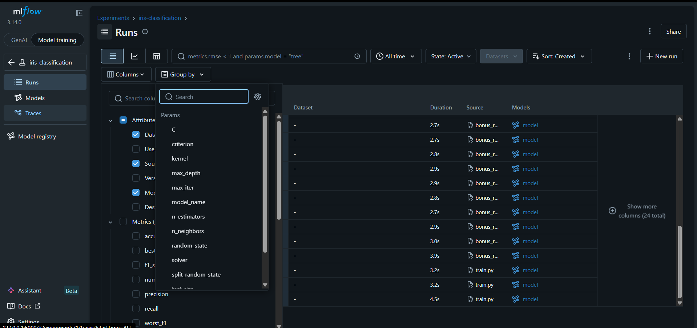
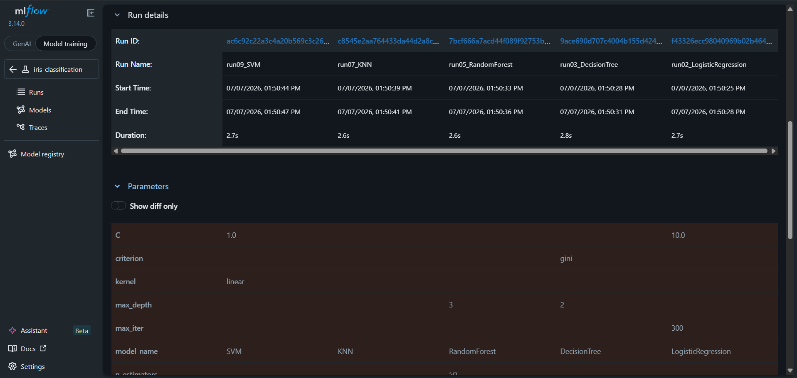
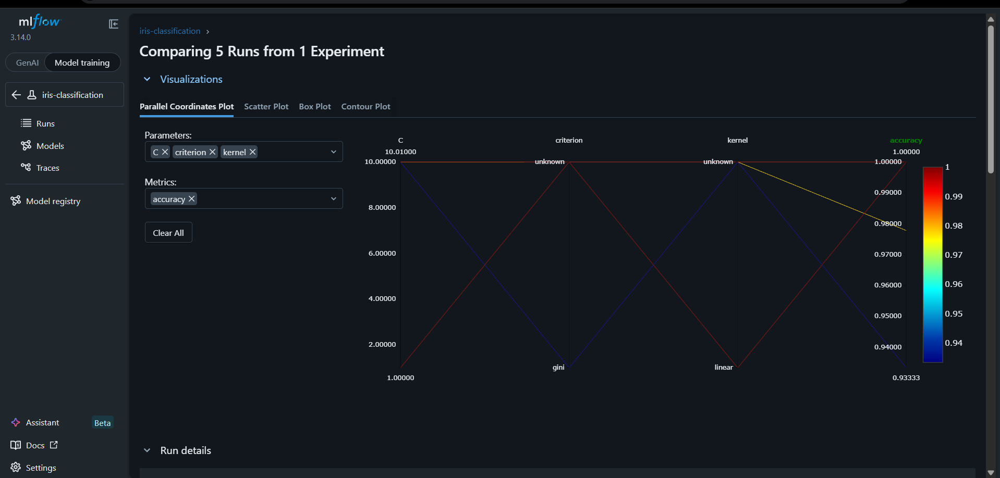
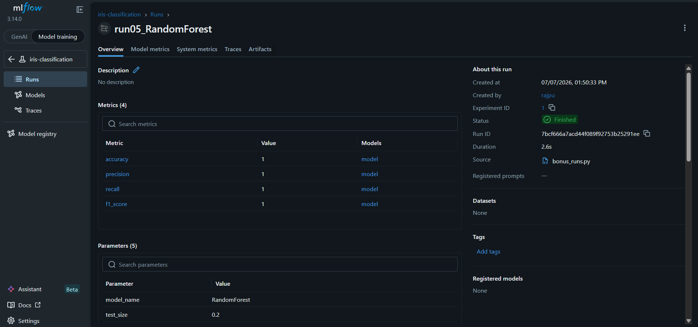

# MLflow Experiment Tracking — Iris Classification

## Objective
Train multiple machine learning models on the Iris dataset, track every
experiment with MLflow (parameters, metrics, artifacts, and models), compare
the runs, and identify the best-performing model.

## Dataset
[Iris dataset](https://scikit-learn.org/stable/datasets/toy_dataset.html#iris-dataset)
from `sklearn.datasets` — 150 samples, 4 numeric features (sepal/petal length
and width), 3 target classes (setosa, versicolor, virginica).

## Project Structure
```
MLFlow-Iris-Classifier/
├── train.py                # Core task: 3 models, 3 tracked runs
├── runs.py                 # 12 tracked runs across 6 model types
├── requirements.txt
├── README.md
├── comparison_table.csv      # Generated after running runs.py
├── confusion_matrix_*.png    # Generated confusion matrix artifacts
├── screenshots/               # Add your MLflow UI screenshots here
└── mlruns/                    # MLflow tracking data (auto-created)
```

## Models Used

### Core runs (`train.py`)
| Model | Hyperparameters |
|---|---|
| Logistic Regression | `C=1.0`, `max_iter=200`, `solver=lbfgs` |
| Decision Tree | `max_depth=4`, `criterion=gini` |
| Random Forest | `n_estimators=100`, `max_depth=5` |

### runs (`runs.py`) — 12 additional runs
Varies **model type**, **hyperparameters**, **train/test split**, and
**random state** across: Logistic Regression, Decision Tree, Random Forest,
KNN, SVM, and Naive Bayes (2 configurations each).

## How to Run

1. **Install dependencies**
   ```bash
   pip install -r requirements.txt
   ```

2. **Run the core experiment (3 tracked runs)**
   ```bash
   python train.py
   ```

3. **Run the experiments (12 more tracked runs + comparison table)**
   ```bash
   python runs.py
   ```
   This produces `comparison_table.csv` and prints a summary table to the
   console, in addition to logging everything to MLflow.

4. **Launch the MLflow UI**
   ```bash
   mlflow ui
   ```
   Then open **http://127.0.0.1:5000** in your browser to:
   - View the **Experiments** dashboard (`iris-classification` experiment)
   - Select multiple runs and use **Compare** to see side-by-side metrics
   - Open the **Metrics** page/chart view for accuracy, precision, recall, F1
   - Take the required screenshots and save them into `screenshots/`

## MLflow Screenshots

The following screenshots demonstrate the MLflow experiment tracking workflow and the comparison of different machine learning models.

### MLflow Home



### Experiment Dashboard

Displays all experiment runs along with their logged parameters, metrics, and execution details.



### Runs Overview

Shows all tracked runs and their corresponding logged information in tabular format.



### Run Comparison Table

Comparison of multiple experiment runs based on their logged metrics and parameters.



### Run Comparison Chart

Visual comparison of experiment metrics across different runs.



### Metrics

Displays detailed metrics such as Accuracy, Precision, Recall, and F1-score for the selected experiment.




## Results — Comparison Table (all 12 runs)

| Run | Model | Accuracy | Precision | Recall | F1-score |
|---|---|---|---|---|---|
| run01_LogisticRegression | LogisticRegression | 0.9667 | 0.9697 | 0.9667 | 0.9666 |
| run02_LogisticRegression | LogisticRegression | 0.9778 | 0.9792 | 0.9778 | 0.9778 |
| run03_DecisionTree | DecisionTree | 0.9333 | 0.9444 | 0.9333 | 0.9327 |
| run04_DecisionTree | DecisionTree | 0.9211 | 0.9209 | 0.9209 | 0.9200 |
| run05_RandomForest | RandomForest | 1.0000 | 1.0000 | 1.0000 | 1.0000 |
| run06_RandomForest | RandomForest | 0.9333 | 0.9345 | 0.9333 | 0.9333 |
| run07_KNN | KNN | 1.0000 | 1.0000 | 1.0000 | 1.0000 |
| run08_KNN | KNN | 0.9474 | 0.9556 | 0.9444 | 0.9459 |
| run09_SVM | SVM | 1.0000 | 1.0000 | 1.0000 | 1.0000 |
| run10_SVM | SVM | 1.0000 | 1.0000 | 1.0000 | 1.0000 |
| run11_NaiveBayes | NaiveBayes | 0.9667 | 0.9697 | 0.9667 | 0.9666 |
| run12_NaiveBayes | NaiveBayes | 0.9434 | 0.9434 | 0.9434 | 0.9429 |

**Best model:** `run05_RandomForest` (also tied with `run07_KNN`, `run09_SVM`,
`run10_SVM`) with **F1-score = 1.0000** on their respective test splits.

**Worst model:** `run04_DecisionTree` with **F1-score = 0.9200** — a shallower
capacity model (`max_depth=6` but a less favorable split/seed) underperformed
relative to ensembles like Random Forest.

## Conclusion

Among all experiments, Random Forest achieved the best overall performance with an F1-score of 1.0000. KNN and SVM also achieved perfect scores on specific train-test splits. Since the Iris dataset is relatively small and well-separated, multiple models can perform exceptionally well. Random Forest was selected as the preferred model because it provides consistently strong performance while maintaining good generalization.

> Note: Iris is a small, easily-separable dataset, so several models reach
> perfect scores on some splits. In practice, prefer the model with the most
> *consistent* high performance across splits (e.g., Logistic Regression /
> Random Forest here) over a single perfect run, to avoid overfitting to one
> particular train/test partition.

## What Gets Logged to MLflow (per run)
- **Parameters:** model name, hyperparameters, `test_size`, `random_state`
- **Metrics:** accuracy, precision (macro), recall (macro), F1-score (macro)
- **Artifacts:** confusion matrix PNG
- **Model:** the trained scikit-learn model (loadable via `mlflow.sklearn.load_model`)


## Pushing to GitHub
```bash
cd mlflow_experiment
git init
git add train.py runs.py requirements.txt README.md comparison_table.csv confusion_matrix_*.png screenshots
git commit -m "MLflow experiment tracking assignment - Iris classification"
git branch -M main
git remote add origin https://github.com/SakshiiRajputt/MLFlow-Iris-Classifier.git
git push -u origin main
```


